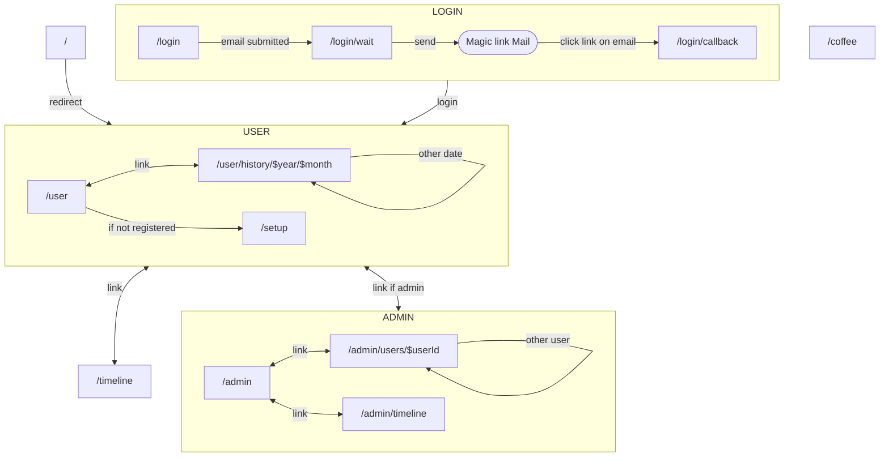

# Z-retailing

## Prerequisites

- Cloudflare
- Supabase
- Prisma Accelerate
- Bun
- Remix

## Set database timezone

```sql
alter database postgres
set timezone to 'Asia/Tokyo';
```

## ページ遷移


```mermaid
graph TD;

  %% root
  / -->|redirect| USER

  %% login
  subgraph LOGIN
    %% /user -->|if not logged in| /login
    /login -->|email submitted| /login/wait
    /login/wait -->|send| mail([Magic link Mail])
    mail -->|click link on email| /login/callback
  end
  
  LOGIN -->|login| USER

  %% user
  subgraph USER
    /user <-->|link| /user/history/$year/$month
    /user/history/$year/$month -->|other date| /user/history/$year/$month
    /user -->|if not registered| /setup
    %% /setup -->|nickname submitted| /user
  end
  
  USER <-->|link| /timeline
  
  USER <-->|link if admin| ADMIN

  %% admin
  subgraph ADMIN
    /admin <-->|link| /admin/users/$userId
    /admin/users/$userId -->|other user| /admin/users/$userId
    /admin <-->|link| /admin/timeline
  end

  %% independant
  /coffee
```
